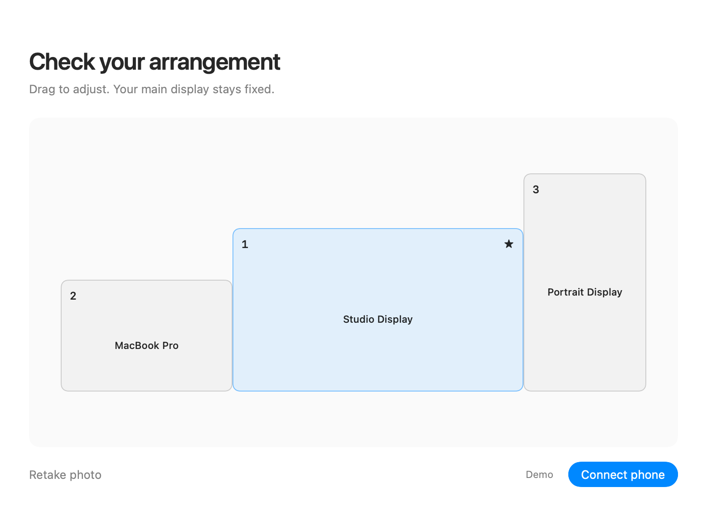

# Screenz

**One photo. Everything in place.**

Screenz is a native macOS menu bar app that turns a phone photo of your desk into a display arrangement. Scan a QR code, photograph the markers on your screens, and review the result before applying it.



## Install

Download the universal **DMG** from [Releases](https://github.com/hdittmar/screenz/releases), open it, and drag **Screenz** to **Applications**. Open the app and look for the **two-display icon in your menu bar**.

- macOS 13 or later; Apple Silicon and Intel.
- No phone app, account, or cloud service.
- Mac and phone on the same local network.

**Current development builds are ad-hoc signed, not Apple-notarized.** macOS may require allowing a trusted build in **System Settings → Privacy & Security** after the first launch attempt. See [release packaging](docs/RELEASING.md) for Developer ID signing and notarization.

## Use

1. Click the menu bar icon and choose **Connect phone**.
2. Scan the QR code with your phone’s camera and open the link in your browser.
3. Tap **Show screen markers**, then photograph all your displays in one image.
4. Tap **Send to my Mac**. Review the detected layout and drag screens to correct offsets.
5. Click **Apply arrangement**, then **Keep arrangement** within 20 seconds. Otherwise, Screenz restores the previous positions.

Press Escape to hide the markers. **Import photo** accepts an image from the current scan, including one sent through AirDrop. Mirroring must be disabled.

Click the menu bar icon to open Screenz directly. Closing the window keeps it running. Right-click the icon for **Launch at Login** and **Quit Screenz**; automatic login launch is off by default.

## Build and test

Install Xcode and its command-line tools, then:

```sh
git clone https://github.com/hdittmar/screenz.git
cd screenz
zsh scripts/build-app.sh
open dist/Screenz.app
```

The build produces a universal app with its icon, phone page, metadata, and license. Open `Package.swift` in Xcode to develop it. No external Swift packages are required.

```sh
zsh scripts/test.sh       # Layout, HTTP, Vision, upload, native UI rendering
zsh scripts/package.sh   # Universal app, DMG, ZIP, SHA-256 checksums
```

Tests never change your display settings. Rendered UI previews are in `.build/previews/`. GitHub Actions tests the app logic, Vision, and uploads on both Apple Silicon and Intel; native screenshot rendering runs on Apple Silicon because Intel hosted VMs lack a working Metal renderer. The workflow builds downloadable development artifacts. Tagged versions produce a draft GitHub release.

## Privacy and limitations

Photos are processed on your Mac, held in memory, and never intentionally saved or sent to a cloud service. Pairing links expire after 15 minutes. The local connection uses **unencrypted HTTP**, so use a trusted network. See [architecture](docs/ARCHITECTURE.md) for the request limits and pairing design.

Photo alignment is approximate. Perspective, angled displays, and different physical pixel densities can affect offsets; check the preview before applying. Screenz preserves the main display, resolution, scaling, refresh rate, and rotation, changing only display positions. Guest Wi-Fi isolation, firewall rules, and VPN routing can block pairing.

## Project

- [Architecture and phone connection](docs/ARCHITECTURE.md)
- [Packaging, signing, and releases](docs/RELEASING.md)
- [Contributing](CONTRIBUTING.md)
- [Report an issue](https://github.com/hdittmar/screenz/issues)
- [MIT license](LICENSE) · Copyright © 2026 Henrik Dittmar
